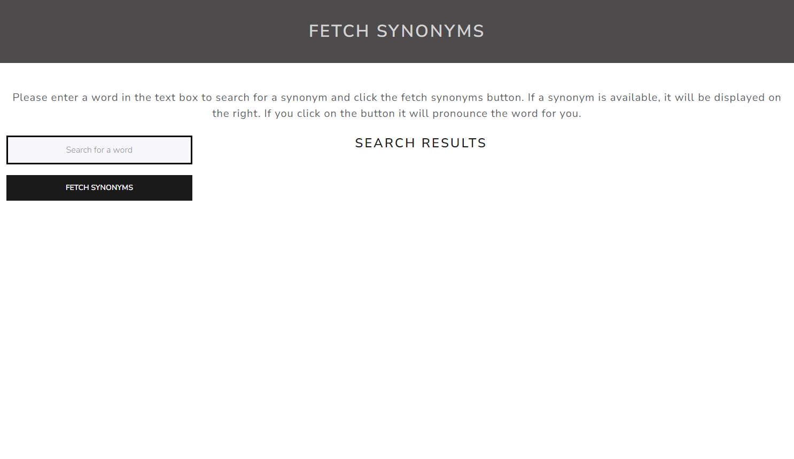
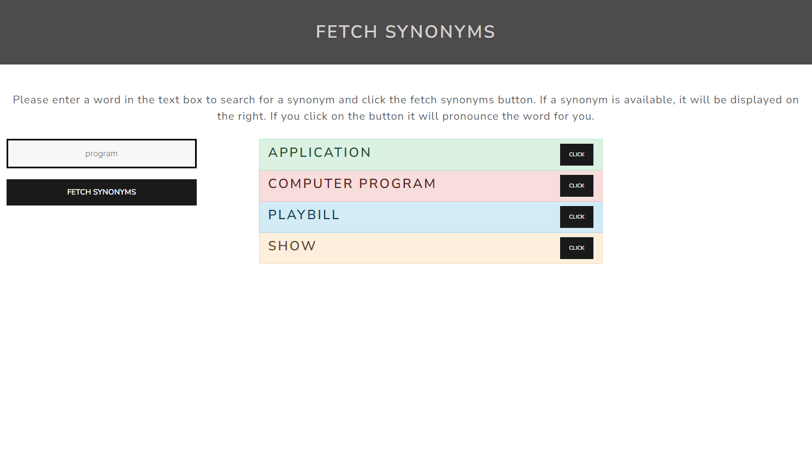

# fetch-synonyms

This is a simple digital thesaurus made to help students, journalists, and writers improve their work by finding substitute words to help round out their vocabulary and reduce redundancy, making their writing more engaging.

## User Story
AS a writer
I WANT to find synonyms for words I commonly use
SO THAT my writing is less repetitive and more engaging

## Acceptance Criteria
GIVEN a digital thesaurus with a form input 
WHEN I input a word and click the fetch synonyms button 
THEN I am presented with synonyms for my original word
WHEN I receive those synonyms
THEN I should have a way to hear their pronunciation

## Github Repo
https://github.com/Dawnie2021/fetch-synonyms

## Site URL

https://dawnie2021.github.io/fetch-synonyms/

## External resources used
Words API: https://www.wordsapi.com/
Speech Synthesizer: https://mdn.github.io/dom-examples/web-speech-api/speak-easy-synthesis/
Bootswatch: https://bootswatch.com/
FavIcon: https://favicon.io/

Made with ❤ by Dawn Nguyen, Jackson Byrd, and Sara Neubert
